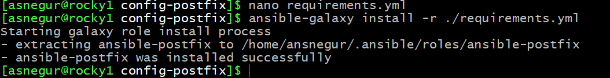
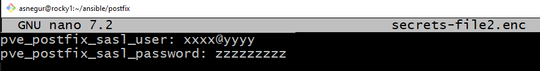
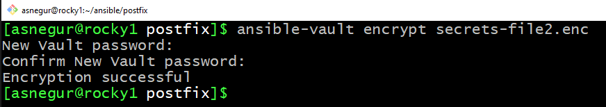
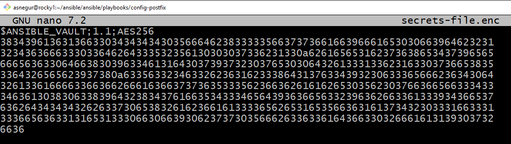
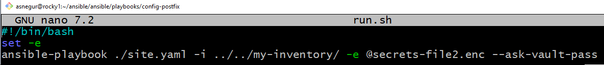

# Postfix setup on VMs via Ansible playbooks
  
  These Ansible playbook configures the postfix service on VMs.

## Prerequisites
  ### 1. Install `Ansible` on a certain Linux host from which Ansible playbooks are to be run, this host is called for brevity below `Ansible host`

  For `Debian` Linux

  ```
  sudo apt update
  sudo apt install ansible
  ```

  or follow [step 2](https://github.com/Alliedium/awesome-ansible#setting-up-config-machine) of `Setting up config machine` section to install the latest Ansible version

  ### 2. Clone this repo

  ```
  git clone https://github.com/Alliedium/awesome-proxmox.git $HOME/awesome-proxmox
  ```

  ### 3. Install Ansible postfix role - [Oefenweb/ansible-postfix](https://github.com/Oefenweb/ansible-postfix)

  ```
  ansible-galaxy install -r $HOME/awesome-proxmox/postfix/playbooks/config-postfix/requirements.yml
  ```

  

  Check installed role

  ```
  ansible-galaxy list
  ```

  
## **Ansible-vault**
 
  Ansible vault provides a way to encrypt and manage sensitive data such as passwords. We use Ansible vault to store `pve_postfix_sasl_user` and `pve_postfix_sasl_password` variables

  - copy `$HOME/awesome-proxmox/postfix/playbooks/config-postfix/secrets-file.enc.example` file to `$HOME/awesome-proxmox/postfix/playbooks/config-postfix/secrets-file.enc` and edit the last one
  
  

  Encrypt `$HOME/awesome-proxmox/postfix/playbooks/config-postfix/secrets-file.enc`  file and set a password by command

  ```
  ansible-vault encrypt $HOME/awesome-proxmox/postfix/playbooks/config-postfix/secrets-file.enc
  ```

  

  `$HOME/awesome-proxmox/postfix/playbooks/config-postfix/secrets-file.enc`  file is encrypted

  

## **Ansible postfix playbook**

  - copy `$HOME/awesome-proxmox/postfix/inventory` folder to `$HOME/awesome-proxmox/postfix/my-inventory`

  - In `$HOME/awesome-proxmox/postfix/my-inventory/hosts.yml` file replace hosts IP addresses to your hosts IP addresses and edit the path to private key to match it on your machine.

 
  **Run ansible playbook**

  Navigate to `$HOME/awesome-proxmox/postfix/playbooks/config-postfix` and run command

  ```
  cd $HOME/awesome-proxmox/postfix/playbooks/config-postfix
  ansible-playbook ./site.yaml -i ../../my-inventory/ -e @secrets-file.enc --ask-vault-pass
  ```
  
  You can edit the file `$HOME/awesome-proxmox/postfix/playbooks/config-postfix/run.sh` by pasting the above command in place of the existing one and run
  
  ```
  $HOME/awesome-proxmox/postfix/playbooks/config-postfix/run.sh
  ```
  
  